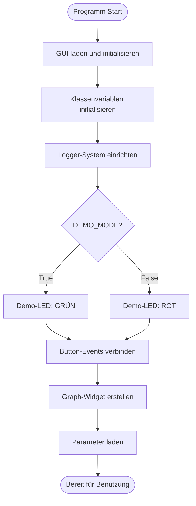
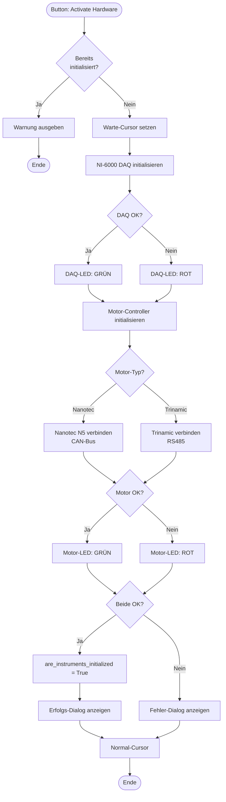
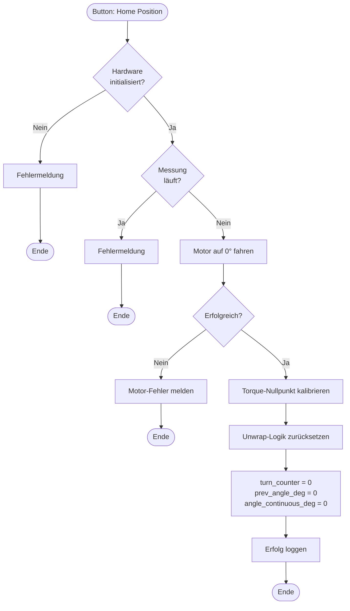
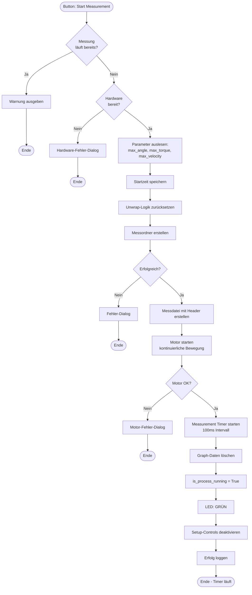
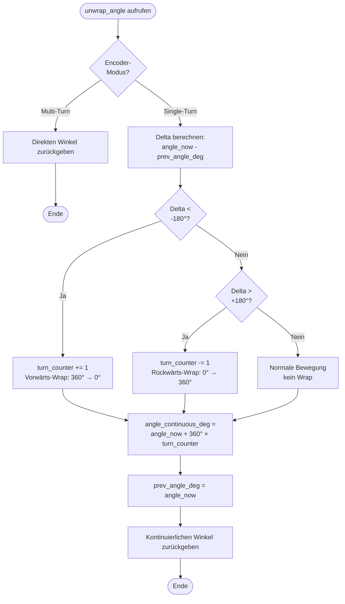
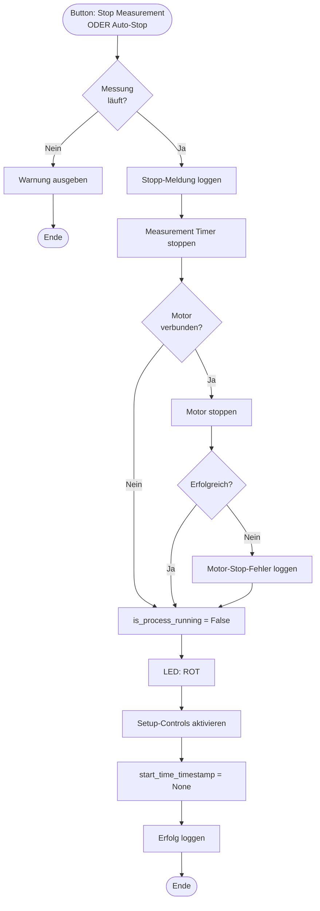
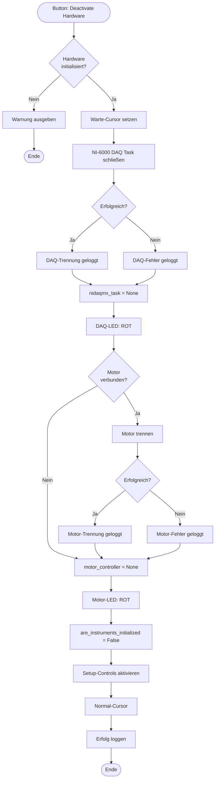
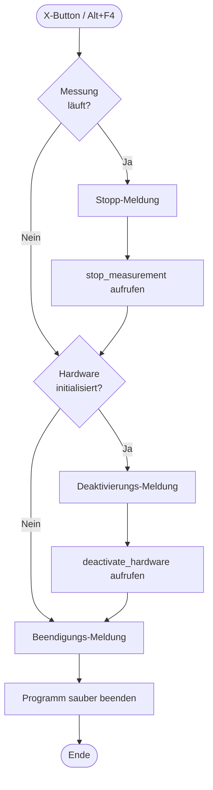
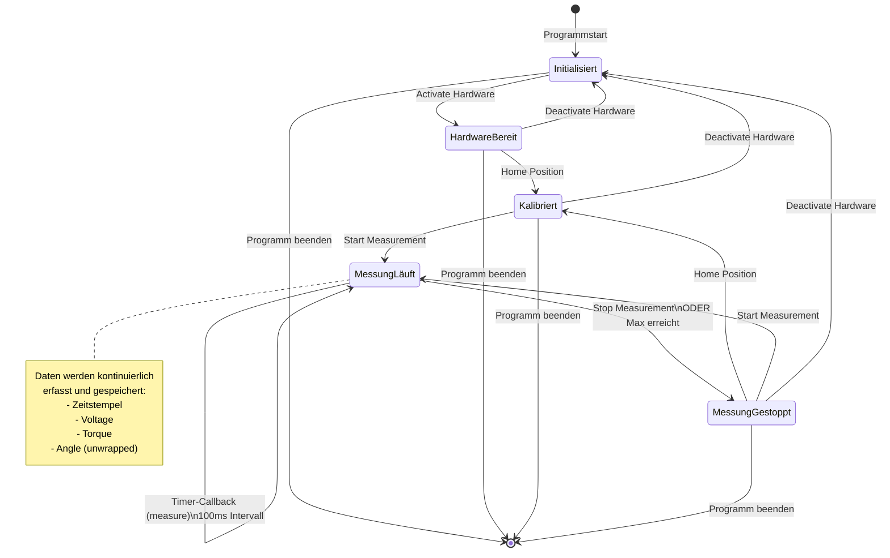

# Programmablaufplan (PAP) - Torsionsmessung

## Überblick
Dieser PAP beschreibt den vollständigen Ablauf einer automatischen Torsionsmessung im TorsionsTestStand V2.0.

---

## 1. Programmstart & Initialisierung



**Funktionen:**
- `__init__()` - Hauptkonstruktor
- `init_class_attributes()` - Variablen-Initialisierung
- `setup_Logger()` - Logging-System
- `connectEvents()` - Button-Verbindungen
- `setup_torque_graph_widget()` - Graph-Darstellung
- `init_parameters()` - Standardwerte setzen

---

## 2. Hardware-Aktivierung



**Funktionen:**
- `activate_hardware()` - Hauptfunktion
- `DAQmxTask.create_nidaqmx_task()` - DAQ-Initialisierung
- `NanotecMotorController.connect()` / `TrinamicMotorController.connect()` - Motor-Verbindung

---

## 3. Home Position & Kalibrierung



**Funktionen:**
- `home_position()` - Hauptfunktion
- `motor_controller.home_position()` - Motor-Home
- `nidaqmx_task.calibrate_torque_zero()` - Nullpunkt-Kalibrierung
- `reset_angle_unwrap()` - Unwrap zurücksetzen

---

## 4. Messung starten



**Funktionen:**
- `start_measurement()` - Hauptfunktion
- `create_measurement_folder()` - Ordner & Datei erstellen
- `motor_controller.move_continuous()` - Motor starten
- `setup_measurement_timer()` - Timer initialisieren
- `reset_graph_data()` - Graph leeren
- `set_setup_controls_enabled(False)` - GUI sperren

---

## 5. Messung durchführen (Timer-Callback)

```mermaid
flowchart TD
    Start([Timer: 100ms Intervall]) --> CheckRun{is_process_running?}
    CheckRun -->|Nein| End1([Ende])
    
    CheckRun -->|Ja| CalcTime[Zeitstempel berechnen<br/>seit Messstart]
    
    CalcTime --> CheckMode{DEMO_MODE?}
    
    CheckMode -->|Ja| SimAngle[Winkel simulieren:<br/>Velocity × Zeit]
    SimAngle --> UpdateSim[Demo-Simulator aktualisieren]
    UpdateSim --> CheckEncoder{Encoder-<br/>Modus?}
    
    CheckEncoder -->|Single-Turn| WrapSim[Wrap auf 0-360°]
    CheckEncoder -->|Multi-Turn| DirectSim[Direkter Winkel]
    
    WrapSim --> UnwrapSim[Unwrap-Logik anwenden]
    UnwrapSim --> ReadTorqueDemo[Simuliertes Torque lesen]
    DirectSim --> ReadTorqueDemo
    
    CheckMode -->|Nein| CheckSource{Angle-<br/>Quelle?}
    
    CheckSource -->|DAQ| ReadAngleDAQ[Angle-Spannung von ai1 lesen]
    CheckSource -->|Motor| ReadAngleMotor[Position vom Motor lesen]
    
    ReadAngleDAQ --> ScaleAngle[Spannung zu Winkel skalieren<br/>0-10V → 0-360°]
    ScaleAngle --> UnwrapAngle[Unwrap-Logik anwenden]
    UnwrapAngle --> ReadTorqueDAQ[Torque-Spannung von ai0 lesen]
    
    ReadAngleMotor --> ReadTorqueDAQ
    ReadTorqueDemo --> CalcTorque[Drehmoment berechnen<br/>Voltage × TORQUE_SCALE]
    ReadTorqueDAQ --> CalcTorque
    
    CalcTorque --> AppendData[Daten zu Listen hinzufügen:<br/>torque_data, angle_data]
    AppendData --> UpdateGraph[Graph aktualisieren<br/>torque_curve.setData]
    
    UpdateGraph --> WriteFile[Daten in Datei schreiben<br/>Tab-getrennt]
    WriteFile --> UpdateGUI[GUI-Felder aktualisieren:<br/>Voltage, Torque, Angle]
    
    UpdateGUI --> CheckAngle{|angle| >=<br/>max_angle?}
    CheckAngle -->|Ja| StopAngle[STOPP:<br/>Max Angle erreicht]
    CheckAngle -->|Nein| CheckTorque{|torque| >=<br/>max_torque?}
    
    CheckTorque -->|Ja| StopTorque[STOPP:<br/>Max Torque erreicht]
    CheckTorque -->|Nein| End2([Ende - Weiter messen])
    
    StopAngle --> CallStop[stop_measurement aufrufen]
    StopTorque --> CallStop
    CallStop --> End3([Ende])
```

**Funktionen:**
- `measure()` - Hauptfunktion (Timer-Callback)
- `unwrap_angle()` - Kontinuierlichen Winkel berechnen
- `nidaqmx_task.read_angle_voltage()` - Winkel-Spannung lesen
- `nidaqmx_task.read_torque_voltage()` - Torque-Spannung lesen
- `write_measurement_data()` - Daten speichern
- `update_measurement_gui()` - GUI aktualisieren
- `stop_measurement()` - Bei Grenzwert stoppen

---

## 6. Unwrap-Logik (Single-Turn Encoder)



**Beispiel:**
- **Zeit 0s:** angle_now=0°, prev=0°, turn_counter=0 → Result: 0°
- **Zeit 35s:** angle_now=350°, prev=340°, delta=+10° → Result: 350° (kein Wrap)
- **Zeit 36s:** angle_now=10°, prev=350°, delta=-340° (< -180°) → turn_counter=1 → Result: 370°
- **Zeit 72s:** angle_now=10°, prev=350°, delta=-340° → turn_counter=2 → Result: 730°

**Funktionen:**
- `unwrap_angle()` - Hauptfunktion
- Verwendet: `turn_counter`, `prev_angle_deg`, `angle_continuous_deg`

---

## 7. Messung stoppen



**Funktionen:**
- `stop_measurement()` - Hauptfunktion
- `measurement_timer.stop()` - Timer stoppen
- `motor_controller.stop_movement()` - Motor stoppen
- `set_setup_controls_enabled(True)` - GUI entsperren

---

## 8. Hardware deaktivieren



**Funktionen:**
- `deactivate_hardware()` - Hauptfunktion
- `nidaqmx_task.close()` - DAQ schließen
- `motor_controller.disconnect()` - Motor trennen
- `set_setup_controls_enabled(True)` - GUI entsperren

---

## 9. Programm beenden



**Funktionen:**
- `closeEvent()` - Hauptfunktion (PyQt6 Lifecycle)
- Ruft auf: `stop_measurement()`, `deactivate_hardware()`

---

## Zusammenfassung: Haupt-Zustandsmaschine



---

## Wichtige Konstanten & Variablen

### Konstanten (in main.py definiert)
```python
DEMO_MODE = True/False              # Demo vs. Hardware-Modus
MEASUREMENT_INTERVAL = 100          # Timer-Intervall [ms]
TORQUE_SCALE = 2.0                  # Nm/V Skalierung
ANGLE_ENCODER_MODE = "single_turn"  # Single-Turn vs. Multi-Turn
ANGLE_MEASUREMENT_SOURCE = "daq"    # DAQ vs. Motor
ANGLE_WRAP_THRESHOLD = 180.0        # Unwrap-Schwellwert [°]
```

### Wichtige Variablen
```python
is_process_running          # Messung läuft
are_instruments_initialized # Hardware bereit
turn_counter               # Umdrehungszähler
prev_angle_deg            # Vorheriger Winkel
angle_continuous_deg      # Kontinuierlicher Winkel
torque_data              # Liste aller Torque-Werte
angle_data               # Liste aller Angle-Werte
start_time_timestamp     # Messstart-Zeitpunkt
```

---

## Dateiformat

### Header
```
# Measurement started: 2025-10-27 14:30:00 - Sample: Probe001
# Max Angle: 360° | Max Torque: 15 Nm | Max Velocity: 10°/s
# Torque Scale: 2 Nm/V | Interval: 100ms
Time            Voltage     Torque      Angle
[HH:mm:ss.f]    [V]         [Nm]        [°]
```

### Datenzeilen (Tab-getrennt)
```
00:00:00.0      0.000000    0.000000    0.000000
00:00:00.1      0.125000    0.250000    1.234567
00:00:00.2      0.250000    0.500000    2.456789
...
```

---

## Fehlerbehandlung

| Fehler | Reaktion | Funktion |
|--------|----------|----------|
| Hardware nicht initialisiert | Fehlerdialog, Abbruch | `start_measurement()` |
| Messung läuft bereits | Warnung, Abbruch | `start_measurement()` |
| Ordner-Erstellung fehlgeschlagen | Fehlerdialog, Abbruch | `create_measurement_folder()` |
| Motor-Start fehlgeschlagen | Fehlerdialog, Abbruch | `start_measurement()` |
| DAQ-Lesefehler während Messung | Warnung, Wert=0.0, weiter | `measure()` |
| Max Angle erreicht | Auto-Stop, Grund loggen | `measure()` |
| Max Torque erreicht | Auto-Stop, Grund loggen | `measure()` |

---

## Performance

- **Mess-Frequenz:** 10 Hz (alle 100ms)
- **Dauer pro measure():** < 5ms
- **CPU-Last:** Gering (non-blocking Timer)
- **Datenpunkte bei 60s Messung:** 600
- **Dateigröße bei 600 Punkten:** ~50 KB

---

**Dokument erstellt:** 2025-10-27  
**Version:** 2.0  
**Autor:** TorsionsTestStand Dokumentation
