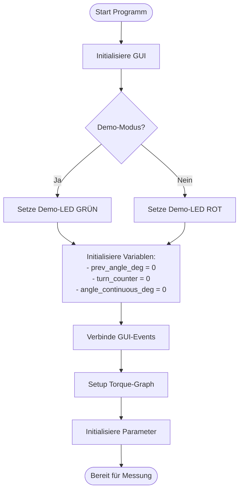
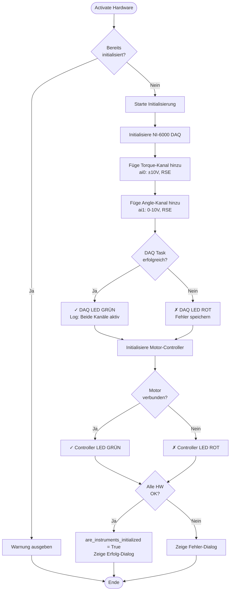
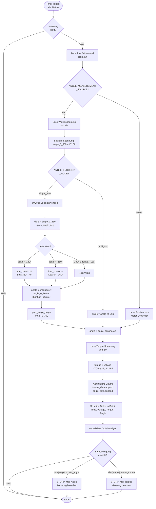
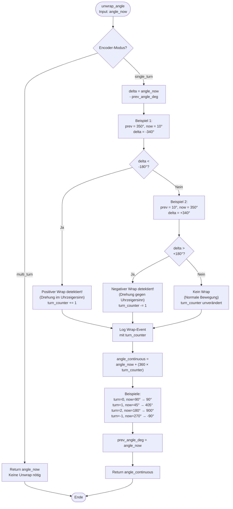
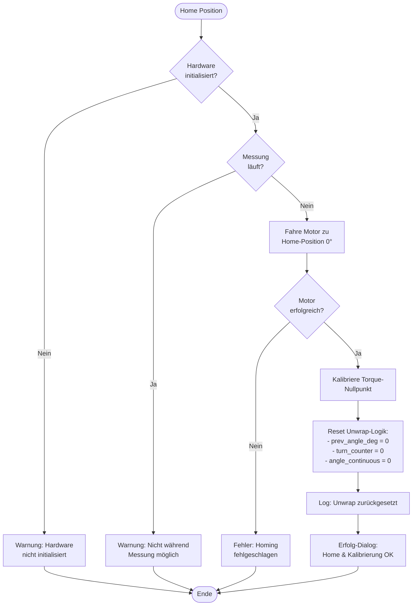

# SSI-Encoder Integration - Winkelmessung via NI-6000 DAQ

## Übersicht

Dieses Dokument beschreibt die Integration eines SSI-Encoders (RS Components RSA 58E) mit einem Motrona 7386.5010 SSI-zu-Analog-Konverter für die präzise Winkelmessung im Torsionsprüfstand.

---

## Systemarchitektur

### Hardware-Komponenten

```
┌─────────────────────┐
│  SSI-Encoder        │
│  RS Components      │
│  RSA 58E            │
│  ─────────────      │
│  13-Bit Single-Turn │
│  12-Bit Multi-Turn  │
│  Gray-Code          │
└──────────┬──────────┘
           │ SSI (CLK+/-, DATA+/-)
           ↓
┌─────────────────────┐
│  Motrona 7386.5010  │
│  SSI-zu-Analog      │
│  Konverter          │
│  ─────────────      │
│  Input: SSI Gray    │
│  Output: 0-10V      │
│  Mapping: 0-360°    │
└──────────┬──────────┘
           │ Analog 0-10V
           ↓
┌─────────────────────┐
│  NI-6000 DAQ        │
│  ─────────────      │
│  ai0: Torque (±10V) │
│  ai1: Angle (0-10V) │
└─────────────────────┘
           │
           ↓
┌─────────────────────┐
│  Python Software    │
│  Torsions Test Stand│
└─────────────────────┘
```

---

## Konfiguration

### 1. Hardware-Einstellungen

#### SSI-Encoder (RS Components RSA 58E)
- **Supply Voltage**: 24V DC
- **Interface**: SSI (Synchronous Serial Interface)
- **Code**: Gray Code
- **Single-Turn Resolution**: 13 Bit (8192 Schritte/Umdrehung)
- **Multi-Turn Resolution**: 12 Bit (4096 Umdrehungen)
- **Output**: Differential (CLK+/-, DATA+/-)

#### Motrona 7386.5010 Konverter
- **SSI Mode**: Master (generiert Clock)
- **Clock Frequency**: 500 kHz
- **Input Format**: Gray Code
- **Total Bits**: 25 (13 Single + 12 Multi)
- **Analog Output**: 0-10V DC
- **Output Mapping**: 0V = 0°, 10V = 360°
- **Resolution**: 16 Bit (Analog Output)
- **Sensor Supply**: 24V @ 250mA max

#### NI-6000 DAQ
- **Channel ai0**: Torque (±10V, Differential/RSE)
- **Channel ai1**: Angle (0-10V, RSE - Referenced Single-Ended)
- **Sample Rate**: 1000 Hz (konfigurierbar)
- **Input Range ai1**: 0-10V

### 2. Software-Konfiguration (main.py)

```python
# ═══════════════════════════════════════════════════════
# WINKELMESSUNG KONFIGURATION
# ═══════════════════════════════════════════════════════

# Messquelle für Winkel wählen
ANGLE_MEASUREMENT_SOURCE = "daq"  # "daq" = NI-6000 | "motor" = Motor-Controller

# Encoder-Betriebsmodus
ANGLE_ENCODER_MODE = "single_turn"  # "single_turn" | "multi_turn"

# DAQ-Kanäle
DAQ_CHANNEL_TORQUE = "Dev1/ai0"  # Drehmoment-Sensor
DAQ_CHANNEL_ANGLE = "Dev1/ai1"   # Winkel-Encoder

# Motrona Analog-Output Skalierung
ANGLE_VOLTAGE_MIN = 0.0    # Minimale Spannung [V]
ANGLE_VOLTAGE_MAX = 10.0   # Maximale Spannung [V]
ANGLE_MIN_DEG = 0.0        # Minimaler Winkel [°]
ANGLE_MAX_DEG = 360.0      # Maximaler Winkel [°]

# Unwrap-Parameter
ANGLE_WRAP_THRESHOLD = 180.0  # Schwellwert für Wrap-Detection [°]
```

---

## Betriebsmodi

### Single-Turn Modus (Standard)

**Beschreibung**: Der Motrona-Konverter gibt nur den Single-Turn-Anteil (0-360°) als Analogsignal aus. Die Software zählt Umdrehungen.

**Eigenschaften**:
- ✅ Kontinuierliche Winkelmessung über mehrere Umdrehungen
- ✅ Drehrichtungserkennung (im/gegen Uhrzeigersinn)
- ✅ Umdrehungszähler in beiden Richtungen
- ⚠️ Erfordert kontinuierliche Abtastung (keine Positionssprünge)

**Anwendungsfall**: Torsionsprüfung mit mehreren Umdrehungen in eine Richtung

**Formel**:
```
angle_continuous = angle_0_360 + (360° × turn_counter)

wobei:
  turn_counter = Anzahl Umdrehungen (+ im Uhrzeiger, - gegen Uhrzeiger)
```

### Multi-Turn Modus (Zukünftig)

**Beschreibung**: Der Encoder liefert absolute Multi-Turn-Information (falls via Motrona digital verfügbar).

**Eigenschaften**:
- ✅ Absolute Positionierung über 4096 Umdrehungen
- ✅ Keine Unwrap-Logik erforderlich
- ✅ Position nach Stromausfall bekannt
- ⚠️ Benötigt digitale Schnittstelle zum Motrona (nicht nur analog)

**Anwendungsfall**: Absolute Positionierung, Langzeitmessung mit Unterbrechungen

---

## Programmablaufplan (PAP)

### Hauptprogramm - Initialisierung



### Hardware-Aktivierung



### Messung - Hauptschleife



### Unwrap-Algorithmus (Detailliert)



### Home-Position & Kalibrierung



---

## Skalierungsformeln

### Spannung → Winkel (0-10V → 0-360°)

```
angle_deg = ((V_meas - V_min) / (V_max - V_min)) × (angle_max - angle_min) + angle_min

Mit Standardwerten:
angle_deg = ((V_meas - 0.0) / (10.0 - 0.0)) × (360.0 - 0.0) + 0.0
angle_deg = V_meas × 36.0
```

**Beispiele**:
| Spannung | Winkel |
|----------|--------|
| 0.0 V    | 0°     |
| 2.5 V    | 90°    |
| 5.0 V    | 180°   |
| 7.5 V    | 270°   |
| 10.0 V   | 360°   |

### Winkel → Spannung (für Demo-Modus)

```
V = ((angle_deg - angle_min) / (angle_max - angle_min)) × (V_max - V_min) + V_min

Mit Standardwerten:
V = (angle_deg / 360.0) × 10.0
```

---

## Unwrap-Logik im Detail

### Prinzip

Der Motrona-Konverter gibt nur 0-360° aus, d.h. bei 360° springt das Signal zurück auf 0° ("Wrap"). Die Software muss diese Sprünge erkennen und Umdrehungen zählen.

### Wrap-Detection

**Positiver Wrap (360° → 0°)**:
```
Vorher: 359°
Nachher: 1°
Delta: 1° - 359° = -358° (< -180°)
→ turn_counter++
```

**Negativer Wrap (0° → 360°)**:
```
Vorher: 1°
Nachher: 359°
Delta: 359° - 1° = +358° (> +180°)
→ turn_counter--
```

**Keine Wrap (normale Bewegung)**:
```
Vorher: 100°
Nachher: 110°
Delta: 110° - 100° = +10° (-180° < delta < +180°)
→ turn_counter unverändert
```

### Kontinuierlicher Winkel

```
angle_continuous = angle_0_360 + (360° × turn_counter)
```

**Beispiele**:

| turn_counter | angle_0_360 | angle_continuous | Beschreibung |
|--------------|-------------|------------------|--------------|
| 0            | 0°          | 0°               | Startposition |
| 0            | 90°         | 90°              | Erste Umdrehung |
| 0            | 359°        | 359°             | Vor erstem Wrap |
| 1            | 1°          | 361°             | Nach erstem Wrap |
| 1            | 180°        | 540°             | 1.5 Umdrehungen |
| 2            | 0°          | 720°             | 2 Umdrehungen |
| -1           | 270°        | -90°             | Rückwärts gedreht |

### Hysterese (optional)

Um Rauschen bei 0°/360° zu vermeiden:

```python
MIN_DELTA = 0.5  # Minimale Änderung zum Ignorieren

if abs(delta) < MIN_DELTA:
    # Ignoriere sehr kleine Änderungen
    return self.angle_continuous_deg  # Vorherigen Wert behalten
```

---

## Validierung & Testing

### 1. Statische Tests (ohne Drehung)

```python
# Test 1: 0° Position
erwartete_spannung = 0.0  # V
erwarteter_winkel = 0.0   # °

# Test 2: 90° Position
erwartete_spannung = 2.5  # V
erwarteter_winkel = 90.0  # °

# Test 3: 180° Position
erwartete_spannung = 5.0  # V
erwarteter_winkel = 180.0 # °

# Test 4: 270° Position
erwartete_spannung = 7.5  # V
erwarteter_winkel = 270.0 # °

# Toleranz
toleranz = 0.02  # V (entspricht ~0.72°)
```

### 2. Dynamische Tests (mit Drehung)

**Test A: Positive Drehung über 360°**
```
1. Starte bei 0°
2. Drehe langsam im Uhrzeigersinn
3. Prüfe bei 359° → 0° Übergang:
   - turn_counter sollte von 0 auf 1 springen
   - angle_continuous sollte von 359° auf 361° gehen
4. Weiter zu 450° (1.25 Umdrehungen)
```

**Test B: Negative Drehung**
```
1. Starte bei 0°
2. Drehe gegen Uhrzeigersinn
3. Prüfe bei 0° → 359° Übergang:
   - turn_counter sollte von 0 auf -1 springen
   - angle_continuous sollte von 0° auf -1° gehen
```

**Test C: Richtungswechsel**
```
1. Drehe zu 720° (2 Umdrehungen)
2. Stoppe
3. Drehe zurück zu 360° (1 Umdrehung)
4. Prüfe: angle_continuous sollte korrekt von 720° auf 360° fallen
```

### 3. Edge Cases

**Rauschen bei 0°/360°**:
```
Symptom: Schnelle Wechsel zwischen 359° und 0°
Ursache: Spannungsrauschen
Lösung: Hysterese oder Mittelwert-Filter
```

**Zu schnelle Drehung**:
```
Symptom: Delta > 180° bei normaler Bewegung
Ursache: Sampling-Rate zu niedrig
Lösung: Erhöhe MEASUREMENT_INTERVAL (z.B. 50ms statt 100ms)
```

**Kalibrierungsfehler**:
```
Symptom: Winkel stimmt nicht mit mechanischer Position überein
Ursache: Motrona-Offset oder falsche Skalierung
Lösung: Prüfe Motrona-Konfiguration, Verkabelung
```

---

## Fehlerbehebung

### Problem: Keine Winkelwerte

**Symptome**:
- angle = 0° (konstant)
- Keine Wrap-Events im Log

**Mögliche Ursachen**:
1. ✓ Verkabelung prüfen (ai1 an Motrona AO)
2. ✓ DAQ-Kanal korrekt? (`DAQ_CHANNEL_ANGLE = "Dev1/ai1"`)
3. ✓ Motrona eingeschaltet und konfiguriert?
4. ✓ SSI-Encoder mit Strom versorgt (24V)?

**Diagnose**:
```python
# Manuelle Messung → Lese Spannung
voltage = nidaqmx_task.read_angle_voltage()
print(f"Angle Voltage: {voltage}V")  # Sollte 0-10V sein
```

### Problem: Falsche Wrap-Detection

**Symptome**:
- turn_counter zählt falsch
- Sprünge im angle_continuous

**Mögliche Ursachen**:
1. ✓ Sampling-Rate zu niedrig (Drehung zu schnell)
2. ✓ ANGLE_WRAP_THRESHOLD falsch (sollte 180° sein)
3. ✓ Rauschen bei 0°/360°

**Lösung**:
```python
# Erhöhe Sampling-Rate
MEASUREMENT_INTERVAL = 50  # Von 100ms auf 50ms

# Optional: Hysterese hinzufügen
if abs(delta) < 0.5:  # Ignoriere < 0.5° Änderungen
    return self.angle_continuous_deg
```

### Problem: Offset im Winkel

**Symptome**:
- Bei mechanisch 0° zeigt Software z.B. 5°

**Mögliche Ursachen**:
1. ✓ Motrona-Nullpunkt falsch kalibriert
2. ✓ Encoder-Montage verdreht
3. ✓ Spannungs-Offset (nicht exakt 0V bei 0°)

**Lösung**:
```python
# Software-Offset hinzufügen
ANGLE_OFFSET_DEG = 5.0  # Korrekturwert
angle_corrected = angle - ANGLE_OFFSET_DEG
```

---

## Performance-Optimierung

### 1. Sampling-Rate

**Standard**: 100ms (10 Hz)
```python
MEASUREMENT_INTERVAL = 100  # ms
```

**Schnelle Drehung**: 50ms (20 Hz)
```python
MEASUREMENT_INTERVAL = 50  # ms
```

**Hochpräzise**: 20ms (50 Hz)
```python
MEASUREMENT_INTERVAL = 20  # ms
```

**Limitierung**: NI-6000 unterstützt bis zu 1000 Hz, aber für Torsionsprüfung ausreichend < 50 Hz

### 2. Datenfilterung (optional)

**Moving Average Filter**:
```python
from collections import deque

angle_buffer = deque(maxlen=5)  # Letzte 5 Werte

def filtered_angle(angle_raw):
    angle_buffer.append(angle_raw)
    return sum(angle_buffer) / len(angle_buffer)
```

**Kalman-Filter** (für sehr rauschige Signale):
```python
# Für fortgeschrittene Anwendungen
from filterpy.kalman import KalmanFilter
```

---

## Dateiformat

### Messdaten-Header

```
# Measurement started: 2025-10-27 14:30:00 - Sample: TorsionTest_001
# Max Angle: 720.0° | Max Torque: 15.0 Nm | Max Velocity: 10.0°/s
# Torque Scale: 2.0 Nm/V | Interval: 100ms
# Angle Source: DAQ (Dev1/ai1) | Encoder Mode: SINGLE_TURN
# SSI Encoder: RS Components RSA 58E (13-bit) via Motrona 7386.5010
Time	Voltage	Torque	Angle
[HH:mm:ss.f]	[V]	[Nm]	[°]
```

### Datenzeilen

```
00:00:00.0	0.000000	0.000000	0.000000
00:00:00.1	0.123456	0.246912	10.500000
00:00:00.2	0.250000	0.500000	21.000000
...
00:01:00.0	5.000000	10.000000	361.500000  ← Nach 1. Umdrehung
```

---

## Zukünftige Erweiterungen

### 1. Multi-Turn via Digitale Schnittstelle

Wenn Motrona digital ausgelesen werden kann:
```python
# Direkter Zugriff auf 25-Bit Wert
total_bits = motrona.read_ssi_raw()
single_turn = total_bits & 0x1FFF  # 13 Bit Maske
multi_turn = (total_bits >> 13) & 0xFFF  # 12 Bit Maske

angle_absolute = (multi_turn * 360.0) + (single_turn / 8192.0 * 360.0)
```

### 2. Automatische Kalibrierung

```python
def auto_calibrate_angle():
    """Finde 0°-Position automatisch durch Motor-Referenzfahrt"""
    motor.home_position()
    angle_voltage_at_zero = daq.read_angle_voltage()
    ANGLE_OFFSET = angle_voltage_at_zero
```

### 3. Live-Qualitätsüberwachung

```python
def check_signal_quality():
    """Überwache Signalqualität"""
    noise_level = np.std(recent_angle_values)
    if noise_level > 0.5:  # Grad
        logger.warning("Hoher Rauschpegel im Winkelsignal!")
```

---

## Literatur & Referenzen

### Datenblätter
- RS Components RSA 58E SSI Encoder
- Motrona 7386.5010 SSI-zu-Analog Konverter
- National Instruments NI-6000 DAQ

### Standards
- SSI Interface Specification (RS-422 Differential)
- Gray Code Encoding

### Software
- NI-DAQmx Python API
- PyQt6 Documentation

---

## Kontakt & Support

**Projekt**: Torsions Test Stand
**Version**: 2.0
**Python**: 3.13
**Datum**: Oktober 2025

---

## Änderungshistorie

| Version | Datum      | Änderung                                    |
|---------|------------|---------------------------------------------|
| 1.0     | 2025-10-27 | Initiale Integration SSI-Encoder/Motrona    |
| 1.1     | 2025-10-27 | Unwrap-Logik für Single-Turn implementiert  |
| 2.0     | 2025-10-27 | Vollständige Dokumentation mit PAP          |

---

**Ende der Dokumentation**
